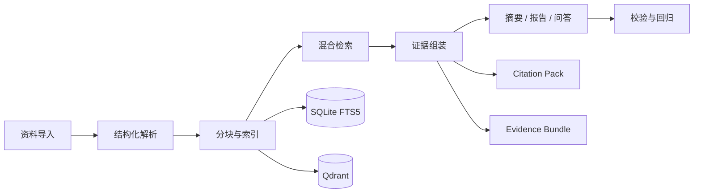

# KnowledgeCurator

**把网页、PDF、Markdown 和零散文本整理成可检索、可引用、可复盘的个人知识库。**

KnowledgeCurator 是一款local-first的 AI 知识整理桌面应用。它将资料导入知识池后，自动完成解析、分块、索引、检索和证据组装，并基于这些证据生成摘要、周报和多轮问答结果。

项目的核心目标是让大模型回答“有依据”：每一次摘要、报告和问答都尽量连接到原始资料片段，保留可检查、可追溯的证据链。

## 适合处理的场景

- 阅读大量网页、PDF 或 Markdown 资料后，需要沉淀成结构化摘要。
- 想对自己的资料库提问，并看到回答引用了哪些原文证据。
- 需要定期把知识池内容整理成周报、重点观点和后续阅读线索。
- 想用 baseline 和回归结果判断 RAG 链路是否真的变好。

## 核心能力

| 能力 | 说明 |
| --- | --- |
| 资料入库 | 支持 URL、PDF、Markdown、纯文本和快速采集入口 |
| 结构化解析 | 保存 parse result、canonical content、metadata、标签和分类 |
| 混合检索 | 结合 Qdrant 向量召回与 SQLite FTS5/BM25 词法召回 |
| 证据追溯 | 生成 citation pack、evidence bundle、grounded claims 和引用映射 |
| 摘要与报告 | 基于证据片段生成摘要、重点观点、周报和 Markdown 输出 |
| 多轮问答 | 支持持久化会话、历史恢复、query rewrite、回答校验和受控重试 |
| 质量回归 | 提供 retrieval/QA eval、baseline comparison、pytest 与 Vitest 测试 |

## 技术亮点

### Evidence-first RAG

系统在生成前先组织证据：检索结果会被转换成 citation pack 和 evidence bundle，再进入摘要、报告或问答链路。生成结果中的关键 claims 可以映射回 citation id、source、section、snippet 和 expanded context。

### Hybrid Retrieval

检索层采用多路召回与融合排序：

- Qdrant vector recall
- SQLite FTS5/BM25 lexical recall
- filter-aware recall
- parent/child chunk
- neighbor context expansion
- merge/rerank

这让系统既能处理语义相近问题，也能保留关键词、标题、章节等精确匹配能力。

### LangGraph Workflow

后端使用 LangGraph 编排摘要、报告和问答链路。检索、证据组装、生成、校验、重试和结果落库被拆成明确节点，便于调试、测试和后续扩展。

### Persistent QA

问答中心支持持久化 session。用户可以恢复历史对话，系统也可以在 query rewrite 中显式使用上下文，并在回答后进行 verification；当证据不足或回答不稳定时，链路会进入受控 retry 或降级。

## 处理流程



## 桌面端模块

| 模块 | 作用 |
| --- | --- |
| 知识池 | 管理资料条目、处理状态、标签、分类和元数据 |
| 解析草稿 | 对网页和 PDF 先生成可确认的解析结果，再提交入库 |
| 运行中心 | 查看摘要、报告等任务的进度、阶段和错误信息 |
| 报告中心 | 基于知识池内容生成周报，并保留历史版本 |
| 问答中心 | 对知识库进行多轮问答，展示引用、校验结果和 QA Trace |
| 快速采集 | 在桌面端快速记录临时资料 |
| 设置面板 | 管理 LLM、Embedding、存储路径、并发和 provider 状态 |

## 技术栈

| 层 | 技术 |
| --- | --- |
| 桌面端 | Electron, Vue 3, Pinia, Element Plus, Vite |
| 后端 | FastAPI, LangGraph, Pydantic |
| 检索与存储 | SQLite, SQLite FTS5, Qdrant local mode / JSON fallback |
| AI Provider | OpenAI-compatible LLM / Embedding provider, stub provider |
| 测试 | pytest, Vitest, Vue Test Utils |

## 目录结构

```text
apps/desktop/
  electron/                 Electron main/preload/tray/shortcut modules
  src/renderer/             Vue pages, stores, components
  scripts/                  desktop dev/build helpers

backend/
  app/
    graphs/                 LangGraph summary/report workflows
    routers/                FastAPI routers
    schemas/                API contracts
    services/               ingestion, retrieval, evidence, QA, report services
  tests/                    pytest suites

scripts/                    backend start and eval helper scripts
```

## 快速开始

### 环境要求

- Node.js 与 pnpm
- Python 3.11+
- uv

不需要单独安装 MySQL、PostgreSQL、独立 Qdrant 服务或真实模型服务。默认启动方式会使用本地文件存储和 stub provider。

### 安装依赖

首次从 GitHub 克隆后，先在仓库根目录安装前后端依赖：

```powershell
pnpm install
uv sync --group test
```

`uv sync --group test` 会创建仓库内的 `.venv`。后端启动脚本会检查 `.venv\Scripts\python.exe`，所以不能跳过这一步。

如果没有 pnpm，可以先启用 Corepack：

```powershell
corepack enable
```

网页采集、应用内网页登录等 Playwright 相关能力需要浏览器二进制。只启动基础后端和桌面端时可以先不装；需要这些能力时再执行：

```powershell
uv run playwright install chromium
```

### 数据库与向量存储

默认开发模式不需要安装独立数据库服务。

- SQLite 数据库会在启动后端时自动创建到 `.local/app-data/backend-dev/knowledge-curator.db`。
- 向量索引默认写入 `.local/app-data/backend-dev/qdrant`；项目会优先使用本地 Qdrant client，失败时回退到 JSON 文件存储。
- `.local/` 是本地运行数据目录，可能包含数据库、索引、导出文件和本地配置，已经被 `.gitignore` 忽略，不要上传。

### 配置模型

默认后端脚本会设置 `stub-llm` 和 `stub-embedding`，所以没有真实模型 key 也能跑通基础流程。

`.env.example` 是配置参考模板，当前启动脚本不会自动读取它。需要接入真实模型时，可以通过设置环境变量、启动脚本参数或桌面端设置面板配置 OpenAI-compatible LLM 与 Embedding provider：

```text
KNOWLEDGE_CURATOR_LLM_PROVIDER=openai-compatible
KNOWLEDGE_CURATOR_LLM_BASE_URL=...
KNOWLEDGE_CURATOR_LLM_API_KEY=...
KNOWLEDGE_CURATOR_EMBEDDING_PROVIDER=openai-compatible
KNOWLEDGE_CURATOR_EMBEDDING_BASE_URL=...
KNOWLEDGE_CURATOR_EMBEDDING_API_KEY=...
```

### 启动后端

```powershell
./scripts/start-backend.ps1
```

脚本默认监听 `http://127.0.0.1:8000`，并自动创建本地数据目录。若 PowerShell 阻止执行脚本，可以用：

```powershell
powershell -ExecutionPolicy Bypass -File scripts/start-backend.ps1
```

如果要直接用真实 provider 启动，也可以传入参数：

```powershell
./scripts/start-backend.ps1 `
  -LlmProvider openai-compatible `
  -LlmModel your-chat-model `
  -EmbeddingProvider openai-compatible `
  -EmbeddingModel your-embedding-model
```

真实 provider 还需要提供对应的 base URL 和 API key；可以在桌面端设置面板里填写，或在当前 shell 中设置 `KNOWLEDGE_CURATOR_*` 环境变量。

### 启动桌面端

```powershell
pnpm dev
```

桌面端默认连接 `http://127.0.0.1:8000`。正常开发时先启动后端，再启动桌面端。

### 本地数据与敏感信息

本地运行数据默认写入 `.local/app-data/backend-dev/`。这个目录可能包含：

- SQLite 数据库和向量索引
- 摘要、周报等导出文件
- 桌面端设置保存的 LLM / Embedding API key
- 网页采集会话配置、本机浏览器 profile 路径等登录相关信息

`.local/` 已经在 `.gitignore` 中忽略，不要上传到 GitHub，也不要打包发给别人。

### 常见问题

**`Missing .venv Python`**

先在仓库根目录运行：

```powershell
uv sync --group test
```

**PowerShell 不允许执行脚本**

使用：

```powershell
powershell -ExecutionPolicy Bypass -File scripts/start-backend.ps1
```

**桌面端提示无法连接后端**

先启动后端并确认它监听在 `http://127.0.0.1:8000`：

```powershell
./scripts/start-backend.ps1
```

**没有真实模型 key**

可以先直接使用默认的 `stub-llm` 和 `stub-embedding` 跑通基础流程。stub 只适合开发和 smoke test，生成质量、摘要效果和语义检索效果不能代表真实模型。

**需要网页采集或应用内网页登录**

安装 Playwright 浏览器：

```powershell
uv run playwright install chromium
```

### 构建

```powershell
pnpm build
```

## 测试

运行桌面端测试：

```powershell
pnpm test:run
```

运行后端测试：

```powershell
python -m pytest backend/tests
```

运行问答链路相关回归：

```powershell
python -m pytest backend/tests/services/test_qa.py backend/tests/services/test_qa_sessions.py backend/tests/api/test_qa_api.py -q
pnpm test:run -- src/renderer/stores/qa.test.ts src/renderer/pages/QaCenter.test.ts
```

## 当前状态

KnowledgeCurator 当前聚焦个人知识库场景下的单 Agent 工作流式 RAG 应用，已经覆盖资料入库、混合检索、证据追溯、摘要报告、多轮问答、回答校验和评测回归。后续可以继续扩展 QA Benchmark Dashboard、context compression、更强 rerank、受控外部搜索和更复杂的多 Agent 编排。
